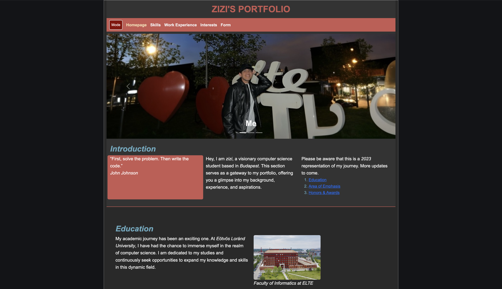
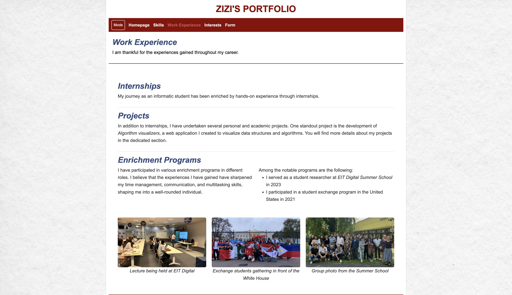
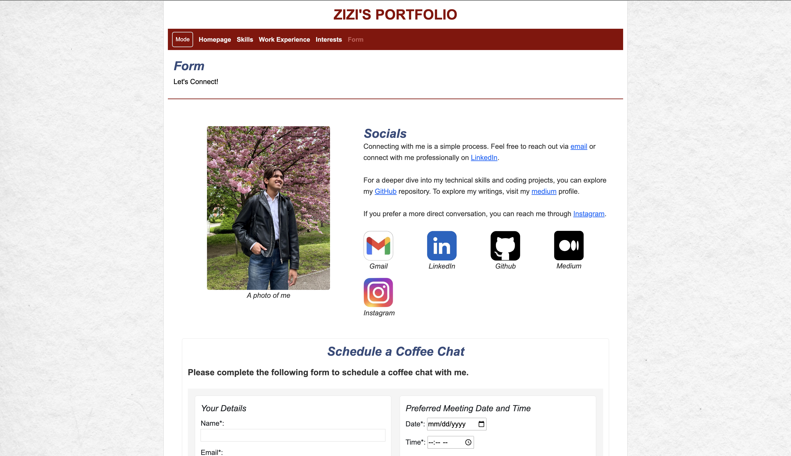
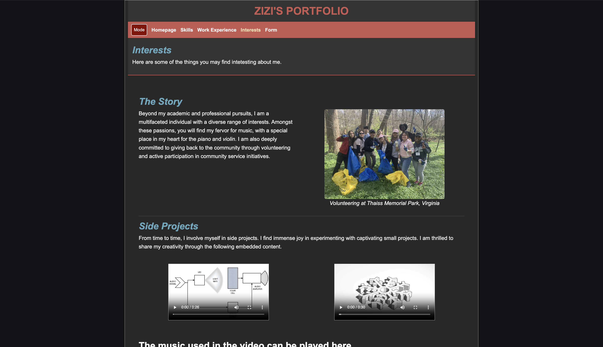

## About

This project is a personal portfolio website for Muhammad Al Farizi. It provides information about his skills, work experience, interests, education, and technical projects in 2023. The site is built using HTML, CSS (Bootstrap), and JavaScript to ensure a responsive and interactive user experience.

## Preview

    
    

    
    

